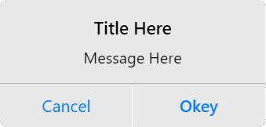

## THIS IS UNTESTED, IF ANY ERRORS HAPPEND. REPORT IT!


---

A simple, modular iOS utility library for haxelib/haxeflixel designed to make native iOS development feel easy—similar to `extension-androidtools`. 

It allows you to request permissions, pop up system alerts, and more!



---

## How do i use it?
The most important step is to get the library. doing via
```yaml
haxelib git IOSTools https://github.com/ChanceXML/IOSTools [BRANCH]
```
Then in a .hx import the file
```haxe
import iostools.ui.IOSAlert;
```
Then you can use it freely
```haxe
IOSAlert.show(
    "TITLE",
    "MESSAGE",
    "BUTTONNAME"
);
```
> recommended version is 0.2.0.

## IMPORTANT NOTE!
THIS WAS MADE FOR IOS 14 AND HIGHER. ANYTHING BELOW THAT WILL CRASH!!

Because iOS values user privacy, your app **will crash** if you do not explain *why* you are asking for permissions. You must add descriptions explaining why you're asking for those permissions and then add it to your project configuration before running it.
